# Mighty Blade Control

Bem-vindo ao **Mighty Blade Control**, um sistema para gerenciamento de fichas e controle de campanhas para o sistema de RPG brasileiro **Mighty Blade**.

## 🚀 Tecnologias

### Backend (API)

<div style="display: inline_block"><br>
  <a href="https://www.python.org/doc/"></a>
  <a href="https://www.djangoproject.com/"></a>
  <a href="https://www.django-rest-framework.org/"></a>
  <a href="https://www.postgresql.org/"></a>
  <a href="https://www.docker.com/"></a>
</div>

### Frontend

🚧 **Em Construção** 🚧


---

## 📦 Instalação e Execução

Para rodar o projeto localmente, você precisará ter instalado:

* [Python 3.10+](https://www.python.org/downloads/)
* [Docker](https://docs.docker.com/get-docker/) & [Docker Compose](https://docs.docker.com/compose/install/)

### Passo a Passo

1.**Clone o repositório** e entre na pasta do projeto:
```bash
    git clone https://github.com/seu-usuario/MightyBladeControl.git
    cd MightyBladeControl
    ```

2.**Configure as Variáveis de Ambiente**:
    Crie um arquivo `.env` dentro da pasta `api` com base no exemplo abaixo:
    ```ini
    # Arquivo: api/.env
    SECRET_KEY=sua_chave_secreta_aqui
    DEBUG=True
    ALLOWED_HOSTS=localhost,127.0.0.1
    DB_NAME=mighty_blade_api
    DB_USER=mighty_user
    DB_PASSWORD=mighty_password
    DB_HOST=db
    DB_PORT=5432
    ```

3.**Suba o Banco de Dados** (via Docker):
    ```bash
    docker-compose up -d
    ```

4.**Configure o Ambiente Python**:
    Você pode usar `venv` ou qualquer gerenciador de sua preferência.
    ```bash
    cd api
    python3 -m venv venv
    source venv/bin/activate  # No Windows: venv\Scripts\activate
    pip install -r requirements.txt
    ```

5.  **Execute as Migrações e o Servidor**:
    ```bash
    python manage.py migrate
    python manage.py runserver
    ```
    O servidor estará rodando em `http://127.0.0.1:8000/`.

---

## 📂 Estrutura do Projeto

Uma visão geral das pastas principais para facilitar a navegação:

```text
MightyBladeControl/
├── api/                    # Código fonte do Backend (Django/DRF)
│   ├── config/             # Configurações globais (settings, urls)
│   ├── core/               # Lógica principal (models, views, serializers)
│   ├── docs/               # Documentação e Dados Estáticos (Diagramas, JSONs)
│   └── manage.py           # Script de gerenciamento do Django
├── docker-compose.yml      # Orquestração de containers (Banco de Dados)
└── README.md               # Este arquivo
```

---

## 📚 Documentação e Estrutura de Dados

### Modelo Entidade-Relacionamento (DER)

Abaixo você encontra o link para o diagrama de estrutura do banco de dados na pasta `docs`.

* 📄 **Arquivo Mermaid**: [api/docs/diagramaER.mmd](api/docs/diagramaER.mmd)
* 🖼️ **Diagrama SVG**: [api/docs/diagramaER.svg](api/docs/diagramaER.svg)

```mermaid
---
config:
  theme: neo-dark
---
erDiagram
    %% --- CORE USER ---
    User ||--o{ Character : "controla"

    %% O Usuário do Django (Autenticação)
    User {
        string username
        string email
        string password_hash
        bool is_active
        date date_joined
    }

    %% --- DADOS ESTATICOS: RAÇA & CLASSE ---
    Race {
        int id PK
        string name "De 'n'"
        text description "De 'd'"
        string slug
        int initial_str
        int initial_agi
        int initial_int
        int initial_wil
    }
    
    RaceLore {
        int id PK
        int race_id FK
        text naming_rules_html "HTML complexo de nomes.json"
        text male_names "Lista extraída"
        text female_names "Lista extraída"
    }

    CharacterClass {
        int id PK
        string name
        text description
        string slug
        int bonus_str
        int bonus_agi
        int bonus_int
        int bonus_wil
    }

    Background {
        int id PK
        string name
        text description
        string benefit_text
    }

    %% --- CORE: HABILIDADES & MAGIAS ---
    Ability {
        int id PK
        string name
        text description
        string category "Geral, Magia, Classe, Racial"
        int mana_cost
        int difficulty
        string casting_time
        string range
        string requirements_text 
    }

    %% Tabelas de Ligação (Regras)
    ClassAvailableAbility {
        int class_id FK
        int ability_id FK
    }
    RaceInnateAbility {
        int race_id FK
        int ability_id FK
    }

    %% --- LINGUISTICA ---
    Language {
        int id PK
        string name "De idiomasComuns/Exoticos"
        text description
        string speakers "Povos que falam"
        bool is_exotic "Flag para diferenciar arquivos"
        string script "Alfabeto usado"
    }

    %% --- BESTIÁRIO & COMPANHEIROS ---
    Creature {
        int id PK
        string name "De animais.json -> n"
        string creature_type "Besta, Ave, Réptil"
        string size "Pequeno, Médio..."
        int strength "a[0]"
        int agility "a[1]"
        int intelligence "a[2]"
        int will "a[3]"
        int hp "v (vida)"
        int mana "m (mana)"
        int defense "d (defesa)"
        jsonb attacks_data "Matriz 'at' complexa"
        jsonb abilities_data "Matriz 'h' e 'ha'"
    }

    SpiritAnimal {
        int id PK
        string name "De espiritosAnimais.json"
    }

    CharacterCompanion {
        int id PK
        int character_id FK
        int creature_id FK
        string custom_name "Nome dado pelo jogador"
        int current_hp
        text notes
    }

    %% --- PERSONAGEM (FICHA) ---
    %% A "Mochila" começa aqui: Dinheiro e Capacidade de Carga
    Character {
        int id PK
        int user_id FK
        string name
        TextField biography
        TextField appearance
        TextField personality
        int level
        int xp
        int race_id FK
        int class_id FK
        int background_id FK
        int strength
        int agility
        int intelligence
        int will
        int hp_max
        int hp_current
        int mana_max
        int mana_current
        %% ECONOMIA (A Carteira)
        int coin_copper "Moedas de Cobre (C$)"
        int coin_silver "Moedas de Prata (P$)"
        int coin_gold "Moedas de Ouro (O$)"
        
        %% SISTEMA DE CARGA
        float extra_carry_capacity "Bônus (ex: Mochila de Carga)"
        float max_load_calculated "Campo virtual (Força x 7 + Extra)"
        float current_load_calculated "Soma do peso de CharacterItem"
    }

    %% --- A TABELA PIVÔ (O SLOT DA MOCHILA) ---
    %% É aqui que a mágica acontece. Liga o char ao item e aplica modificadores.
    CharacterItem {
        int id PK
        int character_id FK
        int item_id FK
        
        %% Customização do Item Específico
        int material_id FK "Opcional (Ex: Aço, Madeira)"
        int quality_id FK "Opcional (Ex: Obra-Prima)"
        
        int quantity "Quantidade (ex: 10 tochas)"
        bool is_equipped "Está empunhando/vestindo?"
        
        %% Campos Virtuais (Properties no Django)
        float final_weight "((Item.weight * Mat.weight_mult) * quantity)"
        int final_price "((Item.price * Mat.price_mult) * Qual.price_mult)"
    }

    %% Relacionamentos do Personagem
    Character }o--|| Race : "é"
    Race ||--|| RaceLore : "possui_regras_de"
    Character }o--|| CharacterClass : "treina"
    Character }o--|| Background : "origem"
    
    %% Skills
    CharacterAbility {
        int id PK
        int character_id FK
        int ability_id FK
        string notes
    }
    Character ||--o{ CharacterAbility : "aprendeu"
    Ability ||--o{ CharacterAbility : "define"

    %% Idiomas
    CharacterLanguage {
        int character_id FK
        int language_id FK
    }
    Character ||--o{ CharacterLanguage : "fala"
    Language ||--o{ CharacterLanguage : "é_falado"

    %% Companheiros
    Character ||--o{ CharacterCompanion : "adestrou"
    Creature ||--o{ CharacterCompanion : "espécie_base"

    %% Regras de Skills
    CharacterClass ||--o{ ClassAvailableAbility : "disponibiliza"
    Ability ||--o{ ClassAvailableAbility : "esta_na_lista"
    Race ||--o{ RaceInnateAbility : "concede"
    Ability ||--o{ RaceInnateAbility : "e_innata"

    %% --- DEFINIÇÕES ESTÁTICAS (OS JSONS) ---
    %% Tabelas de Regra (Read-Only na maior parte do tempo)
    
    Item {
        int id PK
        string name "Espada Longa"
        text description
        decimal base_weight "Peso em Kg"
        int base_price "Preço em Cobre"
        bool is_stackable
        string type "Weapon, Armor, Consumable, Gear"
    }

    %% Herança (Multi-Table Inheritance)
    Weapon {
        int item_ptr_id FK
        int damage
        string damage_type
        string grip "Haste, Leve..."
    }
    Armor {
        int item_ptr_id FK
        int defense_bonus
        int penalty "Penalidade"
    }
    Consumable {
        int item_ptr_id FK
        string rarity
        int charges
    }

    %% --- MODIFICADORES DE ITEM ---
    Material {
        int id PK
        string name "Aço Anão"
        float weight_multiplier "x1.5"
        float price_multiplier "x1.5"
        int damage_bonus "+1"
    }

    ItemQuality {
        int id PK
        string name "Obra-Prima"
        string symbol "Q*"
        float price_multiplier "x10"
        int attack_bonus "+1"
    }

    %% --- RELACIONAMENTOS ---
    Character ||--o{ CharacterItem : "carrega"
    Item ||--o{ CharacterItem : "é_instância_de"
    
    %% Modificadores moldam o item na mochila
    CharacterItem }o--|| Material : "feito_de"
    CharacterItem }o--|| ItemQuality : "tem_qualidade"

    %% Herança do Django
    Item ||--|{ Weapon : "é"
    Item ||--|{ Armor : "é"
    Item ||--|{ Consumable : "é"

```



### Fonte de Dados

Os dados base utilizados neste projeto (como listas de habilidades, raças, itens, etc.) são carregados a partir de arquivos JSON estáticos localizados na pasta `api/docs`. Esses arquivos foram obtidos através de **Web Scraping** na ferramenta oficial da comunidade, a **Forja**:

* 📂 **Localização dos arquivos**: `api/docs/*.json` (ex: `racas.json`, `classes.json`, `animais.json`)
* 🔗 **Fonte Original**: [https://editorarunas.com.br/forja/](https://editorarunas.com.br/forja/)

---

## 🐉 Sobre o Mighty Blade

**Mighty Blade** é um sistema de RPG de mesa brasileiro, criado por **Tiago Junges** e mantido pela **Editora Runas**. Ele é conhecido por sua simplicidade, flexibilidade e por ser um sistema aberto e acessível.

> "Aventure-se em Drakon, um mundo de perigos e magia!"

Todos os direitos do sistema pertencem aos seus criadores. Este projeto é uma ferramenta de fã para fã, criada para auxiliar mestres e jogadores.

### Créditos

* **Sistema Oficial**: [Editora Runas - Mighty Blade RPG](https://editorarunas.com.br/mighty-blade-rpg/)
* **Criador**: Tiago Junges
